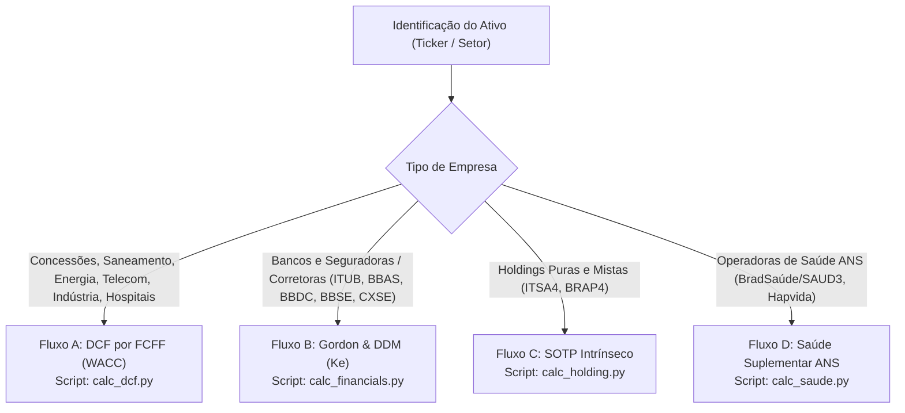

# Valuation Fundamentalista para Ações Brasileiras (B3)

Esta skill guia o agente Antigravity na execução completa do processo de Valuation para empresas listadas na B3, com foco especial em **empresas de infraestrutura, dividendos e previdenciárias**, garantindo rigor contábil, cálculos exatos via Python, proteção contra viés de ancoragem e exportação padronizada em JSON para a Calculadora Web.

---

## 🧭 Fase 0: Roteamento Inteligente de Metodologia

Antes de iniciar qualquer coleta, identifique a natureza contábil e societária da empresa para acionar o motor de valuation correto:



> [!TIP]
> Você pode executar a triagem automática via terminal executando:
> `python valuation_cli.py route --ticker <TICKER>`

* **Fluxo A — DCF por FCFF / WACC (`calc_dcf.py`):**
  * Saneamento (SAPR4, SBSP3, CSMG3), Energia Elétrica (ALUP11, CPFE3, EGIE3, TAEE11), Telecom (TIMS3, VIVT3), Rodovias/Logística (CCRO3, ECOR3, STBP3), Indústria (WEGE3, TUPY3), Hospitais e Redes de Diagnóstico (RDOR3, FLRY3).
* **Fluxo B — Gordon Growth & DDM (`calc_financials.py`):**
  * Bancos (ITUB4, BBAS3, BBDC4, SANB11) e Seguradoras/Bancassurance (BBSE3, CXSE3).
  * *Fundamento:* A dívida/depósitos faz parte da operação e o caixa livre que chega ao acionista é limitado pelo Índice de Basileia ou Margem de Solvência da Susep. Usa-se $K_e$ (Custo do Capital Próprio) em vez de WACC.
* **Fluxo C — SOTP a Valor Intrínseco (`calc_holding.py`):**
  * Holdings (ITSA4, BRAP4, SIMH3).
  * *Fundamento Anti-Bolha:* Para evitar herdar eventuais cotações de mercado infladas das controladas (ex: se Itaú estiver caro na bolsa), o modelo calcula tanto o **SOTP a Valor de Mercado** quanto o **SOTP a Valor Intrínseco** (utilizando o Preço Justo fundamentalista calculado para a investida).
* **Fluxo D — DDM Regulatório ANS (`calc_saude.py`):**
  * Operadoras de Planos de Saúde com provisões técnicas (BradSaúde/SAUD3, HAPV3, ODPV3).
  * *Fundamento:* Calibra a Sinistralidade Médica (MLR), o rendimento do *float* das provisões técnicas e a retenção de lucros exigida pela Margem de Solvência da ANS.

---

## 📋 As 4 Fases de Execução (Rigor Metodológico)

### Fase 1: Coleta Bruta (Isolando Fatos)

> [!WARNING]
> **REGRA DE ATUALIDADE TEMPORAL (ANTI-DESATUALIZAÇÃO):**
> * **NUNCA chumbe anos passados nas buscas** (ex: NUNCA pesquise termos fixos como `"DFP 2024"` ou `"4T24"`). Identifique o ano civil atual antes de pesquisar.
> * **Acesse primeiro a Central de Resultados oficial:**
>   Faça buscas como `site:ri.<empresa>.com.br "Central de Resultados"` ou `site:cvm.gov.br "<empresa>" "DFP"`.
> * **Posição Patrimonial Recente:** Para Caixa e Dívida, utilize o último balanço trimestral (ITR) disponível.
> * **Prioridade da pasta `reports/`:** Se o usuário colocar um relatório na pasta `reports/`, utilize esse documento como fonte primária da verdade.

---

### Fase 2: Coleta de Variáveis Conforme o Fluxo

#### Para Fluxo A (DCF Concessões e Indústria):
1. **FCO Bruto e CapEx:** Segregar CapEx de Sustentação, Expansão Remunerada (RAB) e CapEx Não Oneroso (obrigações compulsórias sem remuneração tarifária).
2. **Dívida Financeira Líquida:** Dívida Bruta menos Caixa e Aplicações do último ITR.
3. **Quase-Dívidas / Outros Passivos Onerosos:** Identificar passivos regulatórios (Agepar/Aneel), déficits atuariais de fundos de pensão pós-emprego (Fusanprev, Petros, Funcef) e contingências prováveis.
4. **Base Acionária:** Total de ações emitidas ou Units equivalentes (Milhões).
5. **DPA Projetado:** Dividendo por ação esperado para métricas de Décio Bazin (6% e 8%).

#### Para Fluxo B (Bancos e Seguradoras):
1. **VPA (Valor Patrimonial por Ação):** Do último balanço trimestral publicado.
2. **ROE Sustentável (%):** Média histórica normalizada ou projeção de ciclo de crédito.
3. **Custo de Capital Próprio ($K_e$):** Calculado via CAPM nominal BRL ($R_f + \beta \times ERP$).
4. **Payout Sustentável (%):** Compatível com a folga do Índice de Basileia / capital mínimo regulatório.
5. **DPA Base:** $VPA \times ROE \times \text{Payout}$.

#### Para Fluxo C (Holdings - Ex: Itaúsa):
1. **Participações:** Quantidade de ações e cotação de mercado das investidas.
2. **Preço Justo Intrínseco das Investidas:** Valor fundamentalista derivado no Fluxo B (para ITUB) ou Fluxo A (para CCR/Aegea/Dexco).
3. **Dívida Líquida da Holding:** Debêntures e notas promissórias da holding menos seu caixa próprio.
4. **Desconto de Holding Estrutural (%):** Média histórica (geralmente entre 18% e 22%).
5. **Fluxo de Proventos Recebidos:** Dividendos pagos pelas investidas menos custos de estrutura da holding.

#### Para Fluxo D (Operadoras de Saúde ANS):
1. **Receita Líquida:** Contraprestações emitidas de planos de saúde.
2. **MLR (Sinistralidade Médica %):** Eventos indenizáveis / Receita Líquida.
3. **Resultado Financeiro:** Ganhos obtidos com o *float* das reservas técnicas.
4. **Retenção para Margem de Solvência da ANS (%):** Capital regulatório retido.
5. **Custo de Capital Próprio ($K_e$).**

---

### Fase 3: Parâmetros Macroeconômicos Padronizados (WACC / Ke)

* **Taxa Livre de Risco Real ($R_{f,\text{real}}$):** ETTJ Tesouro IPCA+ (NTN-B) de referência longa (10 a 20 anos).
* **Inflação Esperada:** Mediana do Relatório Focus (Meta de Inflação de longo prazo).
* **Equity Risk Premium (ERP Brasil):** Entre 5,0% e 6,5%.
* **Spread de Governança / Risco Estatal:** Adicionar de 0,5% a 1,5% para empresas de controle estatal.

---

### Fase 4: Execução Exata via Python & Modo Cego

> [!IMPORTANT]
> **O MODO CEGO É OBRIGATÓRIO (BLIND VALUATION):**
> * O agente **NUNCA DEVE CITAR NEM CALCULAR EM TEXTO NO CHAT** o Preço Justo, Preço Teto ou Cotação Atual.
> * Todos os preços ficam guardados **exclusivamente dentro do arquivo JSON** gerado em `valuations/<TICKER>_valuation.json`.
> * No chat, apresente **apenas o Dossiê das Premissas Econômicas** para análise e questionamento do usuário.

#### Comandos de Execução por Tipo de Empresa:

**1. Para Concessões, Utilities e Indústria (DCF):**
```bash
python .agents/skills/dcf-valuation/scripts/calc_dcf.py \
  --ticker <TICKER> \
  --fclf <FCFF_INICIAL_MI> \
  --taxas <G1> <G2> <G3> <G4> <G5> \
  --wacc <WACC_PCT> \
  --cresc-perp <G_PERP_PCT> \
  --divida-liq <DIVIDA_FINANCEIRA_LIQ_MI> \
  --outros-passivos <PASSIVOS_REGULATORIOS_ATUARIAIS_MI> \
  --num-acoes <ACOES_MI> \
  --margem 20.0 \
  --dpa <DPA_PROJETADO> \
  --empresa "<NOME>" \
  --setor "<SETOR>"
```

**2. Para Bancos e Seguradoras (Gordon & DDM):**
```bash
python .agents/skills/dcf-valuation/scripts/calc_financials.py \
  --ticker <TICKER> \
  --vpa <VPA_REAIS> \
  --roe <ROE_PCT> \
  --ke <KE_PCT> \
  --cresc-perp <G_PERP_PCT> \
  --payout <PAYOUT_PCT> \
  --num-acoes <ACOES_MI> \
  --margem 20.0 \
  --tipo banco \
  --empresa "<NOME>" \
  --setor "Bancos"
```

**3. Para Holdings (SOTP Intrínseco & Mercado):**
```bash
python .agents/skills/dcf-valuation/scripts/calc_holding.py \
  --ticker ITSA4 \
  --itub-acoes 3500.0 \
  --itub-preco-mercado <COTACAO_ITUB> \
  --itub-preco-justo <PRECO_JUSTO_ITUB_DO_FLUXO_B> \
  --itub-dpa <DPA_ITUB> \
  --outros-ativos-mercado <OUTROS_MERCADO_MI> \
  --outros-ativos-justo <OUTROS_JUSTO_MI> \
  --outros-ativos-dpa <OUTROS_PROVENTOS_MI> \
  --divida-holding <DIVIDA_ITSA_MI> \
  --num-acoes 10300.0 \
  --desconto 20.0 \
  --margem 20.0
```

**4. Para Operadoras de Saúde ANS:**
```bash
python .agents/skills/dcf-valuation/scripts/calc_saude.py \
  --ticker <TICKER> \
  --receita <RECEITA_MI> \
  --mlr <SINISTRALIDADE_PCT> \
  --ke <KE_PCT> \
  --cresc-perp <G_PERP_PCT> \
  --num-acoes <ACOES_MI> \
  --margem 20.0
```

---

### Apresentação no Chat: Dossiê das Premissas
Após executar o script correspondente, apresente o Dossiê das Premissas no chat (sem citar preços):
1. **Memória de Fluxos / Resultados:** Detalhe a origem dos dados contábeis (DFP/ITR).
2. **Taxa de Desconto ($WACC$ ou $K_e$):** Abra todos os componentes macroeconômicos ($R_f$, inflação, beta, ERP).
3. **Trajetória de Crescimento ($g$ e $g_{\text{perp}}$):** Justifique os percentuais ano a ano.
4. **Estrutura Patrimonial:** Dívida financeira líquida, quase-dívidas regulatórias/atuariais e número de ações.
5. **Métrica Previdenciária de Bazin:** DPA adotado e confirmação de integração dos Tetos de 6% e 8% no JSON.
6. **Caminho do Arquivo:** Informe o caminho `valuations/<TICKER>_valuation.json` pronto para ser importado na Calculadora Web.
