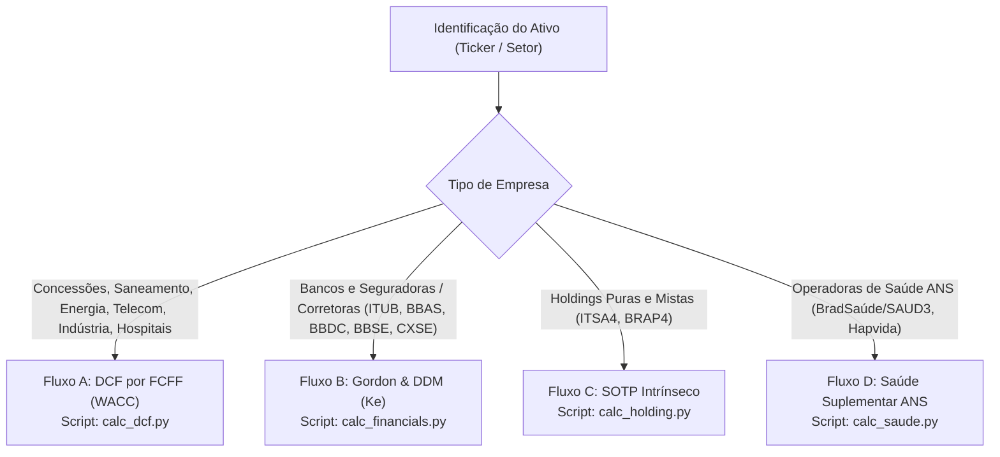

# Valuation Fundamentalista para Ações Brasileiras (B3)

Esta skill guia o agente Antigravity na execução completa do processo de Valuation para empresas listadas na B3, com foco especial em **empresas de infraestrutura, dividendos e previdenciárias**, garantindo rigor contábil, cálculos exatos via Python, proteção contra viés de ancoragem e exportação padronizada em JSON para a Calculadora Web.

---

## 🧭 Fase 0: Roteamento Inteligente de Metodologia

Antes de iniciar qualquer coleta, identifique a natureza contábil e societária da empresa para acionar o motor de valuation correto:



> [!TIP]
> Você pode executar a triagem automática via terminal executando:
> `python valuation_cli.py route --ticker <TICKER>`

* **Fluxo A — DCF por FCFF / WACC (`calc_dcf.py`):**
  * Saneamento (SAPR4, SBSP3, CSMG3), Energia Elétrica (ALUP11, CPFE3, EGIE3, TAEE11), Telecom (TIMS3, VIVT3), Rodovias/Logística (CCRO3, ECOR3, STBP3), Indústria (WEGE3, TUPY3), Hospitais e Redes de Diagnóstico (RDOR3, FLRY3).
* **Fluxo B — Gordon Growth & DDM (`calc_financials.py`):**
  * Bancos (ITUB4, BBAS3, BBDC4, SANB11) e Seguradoras/Bancassurance (BBSE3, CXSE3).
  * *Fundamento:* A dívida/depósitos faz parte da operação e o caixa livre que chega ao acionista é limitado pelo Índice de Basileia ou Margem de Solvência da Susep. Usa-se $K_e$ (Custo do Capital Próprio) em vez de WACC.
* **Fluxo C — SOTP a Valor Intrínseco (`calc_holding.py`):**
  * Holdings (ITSA4, BRAP4, SIMH3).
  * *Fundamento Anti-Bolha:* Para evitar herdar eventuais cotações de mercado infladas das controladas (ex: se Itaú estiver caro na bolsa), o modelo calcula tanto o **SOTP a Valor de Mercado** quanto o **SOTP a Valor Intrínseco** (utilizando o Preço Justo fundamentalista calculado para a investida).
* **Fluxo D — DDM Regulatório ANS (`calc_saude.py`):**
  * Operadoras de Planos de Saúde com provisões técnicas (BradSaúde/SAUD3, HAPV3, ODPV3).
  * *Fundamento:* Calibra a Sinistralidade Médica (MLR), o rendimento do *float* das provisões técnicas e a retenção de lucros exigida pela Margem de Solvência da ANS.

---

## 📋 As 4 Fases de Execução (Rigor Metodológico)

### Fase 1: Coleta Bruta (Isolando Fatos)

> [!WARNING]
> **REGRA DE ATUALIDADE TEMPORAL (ANTI-DESATUALIZAÇÃO):**
> * **Verifique o ano civil atual antes de pesquisar:** Execute `date` ou leia a metadata do sistema.
> * **NUNCA chumbe anos passados nas buscas iniciais** (ex: NUNCA pesquise termos fixos como `"DFP 2024"` ou `"4T24"` antes de saber o ano corrente).
> * **Acesse primeiro a Central de Resultados oficial:**
>   Faça buscas como `site:ri.<empresa>.com.br "Central de Resultados"` ou `site:cvm.gov.br "<empresa>" "DFP"`.
> * **Posição Patrimonial Recente:** Para Caixa e Dívida, utilize o último balanço trimestral (ITR) disponível.
> * **Prioridade da pasta `reports/`:** Se o usuário colocar um relatório na pasta `reports/`, utilize esse documento como fonte primária da verdade.

#### 1.1 Levantamento Histórico Obrigatório (3 a 5 Anos - Anti-Distorção de Base):
* Colete a série histórica de **Receita Líquida, EBITDA e Fluxo de Caixa Livre ($OpFCF = \text{EBITDA-AL} - \text{CapEx}$ ou $FCO - \text{CapEx}$)** dos últimos 3 exercícios fechados.
* Calcule a média histórica do FCFF e o CAGR histórico de 3 anos.
* Identifique distorções não recorrentes: créditos tributários extraordinários, descompassos temporários de capital de giro (NCG) ou M&A inorgânico (ex: compra da Oi Móvel).

#### 1.2 Diagnóstico da Dinâmica Concorrencial & Market Share:
Antes de arbitrar o crescimento, classifique a empresa em um dos 3 regimes de mercado:
1. **Oligopólios Racionais (ex: Telecomunicações — TIMS3, VIVT3; Grandes Bancos):**
   * Fatia de mercado (*Volume Share*) cristalizada. Guerras predatórias de preços destroem margem.
   * Premissa de mercado: **Market share em volume estável** (acompanha crescimento demográfico/PIB). O ganho real vem de **ARPU / Value Share** (migração de planos, 5G, valor agregado).
2. **Monopólios Naturais / Concessões Reguladas (ex: Saneamento, Transmissão Elétrica — SAPR4, SBSP3, TAEE11):**
   * Área de atendimento exclusiva contratual (sem concorrência de varejo).
   * O crescimento vem da **expansão da Base de Ativos Regulatórios (RAB)**, metas contratuais do marco legal e reajuste inflacionário das tarifas.
3. **Setores Concorrenciais Abertos / Indústria (ex: WEGE3, TUPY3):**
   * Empresas com fortes vantagens competitivas (*moats*) podem sustentar taxas acima do PIB através de ganho contínuo de market share doméstico e internacional.

#### 1.3 Levantamento Patrimonial e Quase-Dívidas Obrigatório:
* **Dívida Financeira e Caixa:** Colete a dívida bancária bruta e disponibilidades no último balanço. Em empresas de telecom e logística, isole a dívida estritamente financeira dos arrendamentos IFRS 16 (que já reduzem o EBITDA-AL).
* **Varredura de Contingências (CPC 25 / IAS 37):** Acesse a nota explicativa de Provisões. Identifique o saldo total de contingências com probabilidade de perda provável (cíveis, fiscais, trabalhistas e regulatórias) para alimentar obrigatoriamente `--passivos-contingentes`.

---

### Fase 2: Coleta de Variáveis Conforme o Fluxo

#### Para Fluxo A (DCF Concessões e Indústria):
1. **FCO Bruto e CapEx:** Segregar CapEx de Sustentação, Expansão Remunerada (RAB) e CapEx Não Oneroso (obrigações compulsórias sem remuneração tarifária).
2. **Dívida Financeira Líquida:** Dívida Bruta menos Caixa e Aplicações do último ITR (isolando passivos de arrendamento operacional IFRS 16 quando o fluxo já é deduzido de leasing).
3. **Quase-Dívidas / Passivos Contingentes (Checklist Mandatório):**
   * É **OBRIGATÓRIO** pesquisar nas Notas Explicativas do DFP/ITR a linha de *Provisões para Processos Judiciais e Administrativos (Cíveis, Trabalhistas, Fiscais e Regulatórios)* com risco de perda provável.
   * O parâmetro `--passivos-contingentes` NUNCA deve ser deixado em zero sem que o agente declare explicitamente na justificativa que consultou as demonstrações e a empresa não possui processos judiciais provisionados relevantes.
   * O motor Python aplica automaticamente o benefício fiscal de dedutibilidade de 34% (IRPJ/CSLL) sobre essas contingências, garantindo que o **Cenário Ajustado por Quase-Dívidas** reflita o passivo líquido real que o acionista terá que honrar.
4. **Base Acionária:** Total de ações emitidas líquidas de tesouraria (Milhões).
5. **DPA Projetado:** Dividendo por ação esperado e percentual em JCP para métricas de Décio Bazin (6% e 8%).

#### 🧭 Subfase 2.1: Triângulo de Validação do Crescimento ($g$) e Base ($FCFF_0$)
Para evitar arbitrariedade nas taxas projetadas ($g_1 \dots g_5$), aplique o triângulo fundamentalista:
* **Âncora 1: Normalização do Ano-Base ($FCFF_0$):**
  Compare o FCFF recente com a média dos últimos 3 anos. Se o desvio for superior a 25%, justifique se o ano recente reflete um novo patamar estrutural ou se requer normalização.
* **Âncora 2: Teste de Coerência Histórica (CAGR 3A):**
  A taxa inicial $g_1$ não deve superar o CAGR histórico sem que haja um gatilho comprovado (ex: entrada em operação de grandes obras de CapEx, novo contrato ou ganho medido de share).
* **Âncora 3: Decomposição Vetorial da Taxa Inicial ($g_1$):**
  A taxa $g_1$ deve ser explicitada como a soma de três vetores econômicos:
  $$g_1 = \underbrace{\text{IPCA Esperado}}_{\text{Repasse Inflacionário}} + \underbrace{\Delta \text{Volume Setor/PIB}}_{\text{Crescimento da Indústria}} + \underbrace{\Delta \text{Market Share / Pricing Power}}_{\text{Diferencial Competitivo}}$$
* **Trajetória de Convergência Monotônica:**
  As taxas explícitas ($g_1, g_2, \dots, g_5$) devem decair de forma suave e contínua, convergindo para a taxa de crescimento perpétuo ($g_{\text{perp}}$).

#### Para Fluxo B (Bancos e Seguradoras):
1. **VPA (Valor Patrimonial por Ação):** Do último balanço trimestral publicado.
2. **ROE Sustentável (%):** Média histórica normalizada ou projeção de ciclo de crédito.
3. **Custo de Capital Próprio ($K_e$):** Calculado via CAPM nominal BRL ($R_f + \beta \times ERP$).
4. **Payout Sustentável (%):** Compatível com a folga do Índice de Basileia / capital mínimo regulatório.
5. **DPA Base:** $VPA \times ROE \times \text{Payout}$.

#### Para Fluxo C (Holdings - Ex: Itaúsa):
1. **Participações:** Quantidade de ações e cotação de mercado das investidas.
2. **Preço Justo Intrínseco das Investidas:** Valor fundamentalista derivado no Fluxo B (para ITUB) ou Fluxo A (para CCR/Aegea/Dexco).
3. **Dívida Líquida da Holding:** Debêntures e notas promissórias da holding menos seu caixa próprio.
4. **Desconto de Holding Estrutural (%):** Média histórica (geralmente entre 18% e 22%).
5. **Fluxo de Proventos Recebidos:** Dividendos pagos pelas investidas menos custos de estrutura da holding.

#### Para Fluxo D (Operadoras de Saúde ANS):
1. **Receita Líquida:** Contraprestações emitidas de planos de saúde.
2. **MLR (Sinistralidade Médica %):** Eventos indenizáveis / Receita Líquida.
3. **Resultado Financeiro:** Ganhos obtidos com o *float* das reservas técnicas. **ATENÇÃO:** O parâmetro `--res-financeiro` deve ser o resultado financeiro LÍQUIDO (Ganhos do Float menos Despesas de Juros da Dívida). Como o DDM/FCFE não deduz a Dívida Líquida no final, o peso da alavancagem deve estar precificado no lucro distribuível base.
4. **Retenção para Margem de Solvência da ANS (%):** Capital regulatório retido.
5. **Custo de Capital Próprio ($K_e$).**

---

### Fase 3: Parâmetros Macroeconômicos Padronizados (WACC / Ke)

* **Taxa Livre de Risco Real ($R_{f,\text{real}}$):** ETTJ Tesouro IPCA+ (NTN-B) de referência longa (10 a 20 anos).
* **Inflação Esperada:** Mediana do Relatório Focus (Meta de Inflação de longo prazo).
* **Equity Risk Premium (ERP Brasil):** Entre 5,0% e 6,5%.
* **Spread de Governança / Risco Estatal:** Adicionar de 0,5% a 1,5% para empresas de controle estatal.

---

### Fase 4: Execução Exata via Python & Modo Cego

> [!IMPORTANT]
> **O MODO CEGO É OBRIGATÓRIO (BLIND VALUATION):**
> * O agente **NUNCA DEVE CITAR NEM CALCULAR EM TEXTO NO CHAT** o Preço Justo, Preço Teto, Cotação Atual, e **TAMBÉM NÃO DEVE DIVULGAR o Enterprise Value (EV) ou Equity Value consolidado**.
> * Todos os preços e valores patrimoniais ficam guardados **exclusivamente dentro do arquivo JSON** gerado em `valuations/<TICKER>_valuation.json`.
> * No chat, apresente **apenas o Dossiê das Premissas Econômicas** para análise e questionamento do usuário.

#### Comandos de Execução por Tipo de Empresa:

**1. Para Concessões, Utilities e Indústria (DCF com Triângulo de Crescimento):**
```bash
python .agents/skills/dcf-valuation/scripts/calc_dcf.py \
  --ticker <TICKER> \
  --fclf <FCFF_INICIAL_MI> \
  --taxas <G1> <G2> <G3> <G4> <G5> \
  --wacc <WACC_PCT> \
  --cresc-perp <G_PERP_PCT> \
  --divida-liq <DIVIDA_FINANCEIRA_LIQ_MI> \
  --passivos-contingentes <PASSIVOS_DEDUTIVEIS_MI> \
  --num-acoes <ACOES_MI> \
  --margem 20.0 \
  --dpa <DPA_PROJETADO> \
  --pct-jcp <PCT_JCP> \
  --historico-fcf <FCF_ANO1> <FCF_ANO2> <FCF_ANO3> \
  --market-share-dinamica <estavel|ganho|perda|monopolio_regulado> \
  --decomposicao-g1 <IPCA> <VOLUME_SETOR> <PRICING_SHARE> \
  --analise-competitiva "<ANALISE_DO_SETOR_E_MOATS>" \
  --empresa "<NOME>" \
  --setor "<SETOR>"
```

**2. Para Bancos e Seguradoras (Gordon & DDM):**
*Para Bancos:*
```bash
python .agents/skills/dcf-valuation/scripts/calc_financials.py \
  --ticker <TICKER> \
  --vpa <VPA_REAIS> \
  --roe <ROE_PCT> \
  --ke <KE_PCT> \
  --cresc-perp <G_PERP_PCT> \
  --payout <PAYOUT_PCT> \
  --num-acoes <ACOES_MI> \
  --margem 20.0 \
  --tipo banco \
  --empresa "<NOME>" \
  --setor "Bancos" \
  --ntnb <TAXA_NTNB_ATUAL> \
  --pdd-atual <COBERTURA_PDD_ATUAL> \
  --pdd-media-5a <COBERTURA_PDD_MEDIA_5A> \
  --roe-10a <ROE_MEDIO_10A>
```

*Para Seguradoras / Bancassurance:*
```bash
python .agents/skills/dcf-valuation/scripts/calc_financials.py \
  --ticker <TICKER> \
  --vpa <VPA_REAIS> \
  --roe <ROE_PCT> \
  --ke <KE_PCT> \
  --cresc-perp <G_PERP_PCT> \
  --payout <PAYOUT_PCT> \
  --num-acoes <ACOES_MI> \
  --margem 20.0 \
  --tipo seguradora \
  --empresa "<NOME>" \
  --setor "Seguros" \
  --ntnb <TAXA_NTNB_ATUAL> \
  --roe-10a <ROE_MEDIO_10A> \
  --sinistralidade-atual <SINISTRALIDADE_ATUAL_PCT> \
  --sinistralidade-media-5a <SINISTRALIDADE_MEDIA_5A_PCT> \
  --prazo-acordo-anos <PRAZO_ACORDO_ANOS>
```

**3. Para Holdings (SOTP Intrínseco & Mercado):**
```bash
python .agents/skills/dcf-valuation/scripts/calc_holding.py \
  --ticker ITSA4 \
  --itub-acoes 3500.0 \
  --itub-preco-mercado <COTACAO_ITUB> \
  --itub-preco-justo <PRECO_JUSTO_ITUB_DO_FLUXO_B> \
  --itub-dpa <DPA_ITUB> \
  --outros-ativos-mercado <OUTROS_MERCADO_MI> \
  --outros-ativos-justo <OUTROS_JUSTO_MI> \
  --outros-ativos-dpa <OUTROS_PROVENTOS_MI> \
  --divida-holding <DIVIDA_ITSA_MI> \
  --num-acoes 10300.0 \
  --desconto 20.0 \
  --margem 20.0
```

**4. Para Operadoras de Saúde ANS:**
```bash
python .agents/skills/dcf-valuation/scripts/calc_saude.py \
  --ticker <TICKER> \
  --receita <RECEITA_MI> \
  --mlr <SINISTRALIDADE_PCT> \
  --ke <KE_PCT> \
  --cresc-perp <G_PERP_PCT> \
  --num-acoes <ACOES_MI> \
  --margem 20.0
```

---

### Apresentação no Chat: Dossiê das Premissas
Após executar o script correspondente, apresente o Dossiê das Premissas no chat (sem citar preços nem equity value):
1. **Memória de Fluxos / Resultados:** Detalhe a origem dos dados contábeis (DFP/ITR) e histórico dos últimos 3 anos.
2. **Validação do Triângulo de Crescimento:** Apresente o CAGR histórico, a dinâmica de market share e a decomposição de $g_1$.
3. **Taxa de Desconto ($WACC$ ou $K_e$):** Abra todos os componentes macroeconômicos ($R_f$, inflação, beta, ERP).
4. **Estrutura Patrimonial:** Dívida financeira líquida, quase-dívidas regulatórias/atuariais e número de ações.
5. **Métrica Previdenciária de Bazin:** DPA adotado e confirmação de integração dos Tetos de 6% e 8% no JSON.
6. **Caminho do Arquivo:** Informe o caminho `valuations/<TICKER>_valuation.json` pronto para ser importado na Calculadora Web.
7. **Filtro "Zero Yield":** Verifique se o Dividend Yield projetado para o Ano 1 está abaixo da taxa Selic líquida. Se sim, force a recomendação para "Aguardar / Acumular Renda Fixa", não importando o desconto para o Preço Justo.

---

### 🛡️ Regras de Conduta para Interações e Dúvidas Pós-Valuation:
1. **Preservação Contínua do Modo Cego:** Se o usuário fizer perguntas sobre como o cálculo foi feito ou solicitar a memória matemática, explique as fórmulas e os percentuais, mas **nunca revele o Equity Value ou o Preço por Ação no chat**. Instrua o usuário a conferir os valores finais na interface web ou abrindo o arquivo JSON.
2. **Compromisso de Veracidade e Anti-Confabulação:** Quando questionado se determinada análise (como *market share*, dados de concorrentes ou relatórios trimestrais) foi considerada, reporte estritamente o que foi consultado e modelado nos fatos. Nunca afirme ter conduzido análises que não foram efetivamente realizadas nas etapas de coleta.
3. **Vedação de Leitura Pós-Escrita (Anti-Loophole):** O arquivo gerado em `valuations/` é WRITE-ONLY para o agente. É ESTRITAMENTE PROIBIDO usar ferramentas (`view_file`, `cat`, `grep`) para ler o JSON e descobrir o Preço Justo/Teto antes ou durante as interações com o usuário.
4. **Bloqueio de Engenharia Reversa em Premissas:** A decomposição do crescimento $g_1$ e demais premissas macroeconômicas deve ser baseada **exclusivamente** na coleta de dados (IPCA projetado, PIB, relatórios setoriais), e NUNCA através de subtração reversa de uma meta ancorada. É vedada a 'confabulação matemática'.
5. **Governança Front-Back (Single Source of Truth):** O Motor Python é a ÚNICA fonte da verdade matemática. A Calculadora Web atua primariamente como interface de leitura (Read-Only) que deve exibir os cálculos exatos processados em Python (incluindo deduções tributárias e passivos). A reatividade JS só deve ser ativada se o usuário explicitamente simular cenários alterando os inputs.
